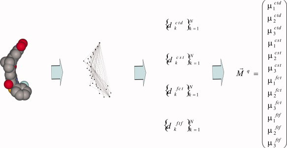
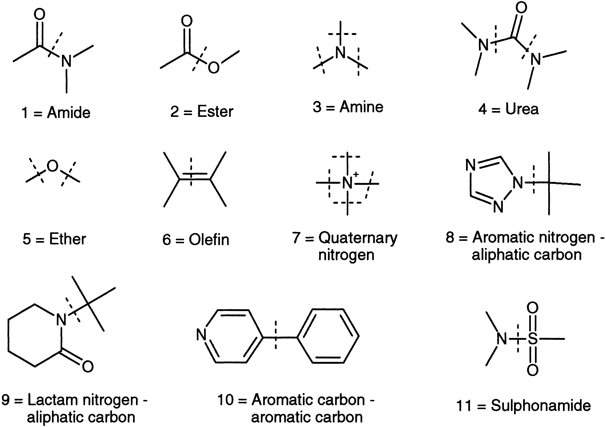
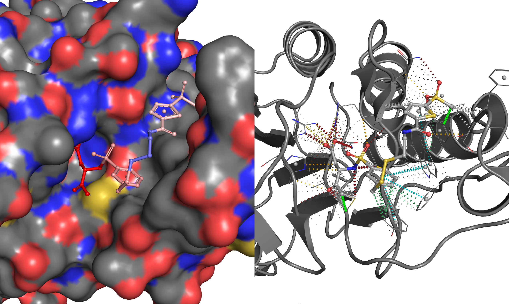

*******************
Chemical components
*******************

Conformers
==========

A maximum of 200 reasonable conformers are generated for each :doc:`chemical component <objects/chemcomp>`
in the PDB using OpenEye’s Omega toolkit with less than 30 rotatable bonds and a
minimum RMS threshold of 0.5Å. It has to be stressed, however, that conformers
for chemical components with more than 20 rotatable bonds are unlikely have the
lowest energy possible because of the rapidly increasing conformational search space.
Chemical components with atoms of elements other than C, N, O, F, S, P, Cl, Br, I,
Si and H are ignored for conformer generation as they are not defined in the MMFF94
force field. Hydrogen atoms are suppressed for the purpose of shape similarity, i.e.
made implicit, for comparisons with ligands stemming from crystal structures.

Descriptors
===========

Physico-chemical properties
---------------------------

Conformation-independent physicochemical descriptors are calculated for all chemical
components in the chemical component dictionary of the PDB. These descriptors are
important to evaluate drug-likeness and filter molecules. Three drug-like filters
are used, the well-known rule-of-five (Lipinski, 2004), the determinants identified
by Ghose *et al*. (1999) after inspection of drug databases and the knowledge-based
approach introduced by Hartshorn *et al*. (2007). All properties are calculated
using the OEChem and OEMolProp toolkits from OpenEye except molecular refractivity
which is calculated with Open Babel (O'Boyle et al., 2008).

Surface descriptors
-------------------

Diller and Merz (2002) identified four surface descriptors that were better at
discriminating between bioactive and modelled conformers, namely the polar and
apolar solvent-accessible surface areas, the radius of gyration and the number
of intermolecular interactions. The *polar and apolar accessible surface areas* are
calculated with the help of OpenEye's OESpicoli toolkit using a 0.5Å resolution
for grid spacing and 1.4Å as probe radius (approximated water sphere). The *radius
of gyration* is the root mean square of the distance between the atoms and the centre of
mass of a conformation:

.. math::
   R_{G}=\sqrt{\frac{1}{N}\sum_{i=1}^{N}\left|\vec{r}_{i}-\vec{r}_{S}\right|^{2}}

The *number of intramolecular interactions* is a simple count of the pairwise contacts
in a molecule for all atom pairs separated by a bond path length of at least three:

.. math::
   NI=\underset{i<j}{\sum}\begin{cases}
   1 & r<4.0\\
   0.5(6-r) & 4.0<r<6.0\\
   0 & r>6.0
   \end{cases}

These descriptors are calculated for all ligands with at least seven heavy atoms
in |CREDO| and their up to 200 conformers, vastly surpassing the small dataset of
only 65 ligands from crystal structures in the original study.

Boolean descriptors
-------------------

Molecular shape moments using Ultrafast Shape Recognition (USR)
---------------------------------------------------------------

The Ultrafast Shape Recognition (USR) algorithm (Ballester *et al*., 2009; Ballester
and Richards, 2007) encodes the shape of a molecule through a vector of 12 unique
geometrical descriptors. These descriptors are the first three statistical moments for
four distance distributions that are derived from placing reference points strategically
within the molecule and measuring their distances to all heavy atoms. The four
reference points within the molecule are the geometric centre (*ctd*), the closest
atom to *ctd* (*cst*), the farthest atom to *ctd* (*fct*), and the farthest atom
to *fct* (*ftf*). A variant of the Manhattan distance is used to estimate the similarity
between two molecules, i.e. between their USR shape descriptors:

.. math::

Strictly speaking, USR does not encode molecular shapes directly as only the atomic
coordinates (and their distributions) are used and not atomic volumes. The USR
algorithm has several advantages. First, it does not rely on molecular alignments
that are computationally expensive to perform. Second, the 12 descriptors (including
the distance metric itself) can conveniently be stored in a conventional database and
used along other SQL query constructs, particularly in the context of CREDO where
it can be combined with protein-ligand information data. Third, the simplicity of
the algorithm and its encoding of molecular shape into only 12 descriptors makes it
orders of magnitude faster than any alignment-based method. Due to the nature of
the algorithm, it is not possible to encode any other surface or atom descriptor such
as polar surface area or element type besides the statistical moments (at least
not is this form). As a result, it is more or less necessary to account for this
lack of pharmacophore encoding by filtering the small molecule database in advance.

   Illustration of the ultrafast shape recognition (USR) algorithm. The shape of
   a molecule is encoded as a vector of 12 unique geometrical descriptors. These
   descriptors are the first three statistical moments for four distance distributions
   that are derived from placing reference points strategically within the molecule
   and measuring their distance to all of its heavy atoms. The four reference points
   within the molecule are the geometric centre (*ctd*), the closest atom to *ctd*
   (*cst*), the farthest atom to *ctd* (*fct*), and the farthest atom to *fct*
   (*ftf*). Reprinted from Ballester and Richards (2007).

Fragmentation of chemical components
====================================

The Retrosynthetic Combinatorial Analysis Procedure (RECAP)
-----------------------------------------------------------

All chemical components from the PDB are subject to a fragmentation process using
a modified and extended *Retrosynthetic Combinatorial Analysis Procedure* (RECAP)
(Lewell *et al*., 1998). The algorithm is implemented using OpenEye’s OEChem toolkit
and modified in favour of a *hierarchical* and *exhaustive* fragmentation strategy.
The original procedure works by fragmenting a molecule through cleavage of eleven
defined bond types, shown in the figure below. If the reaction rule leads to hydrogen
or a very small fragment with less than three atoms, the cleavage is not performed
and this part of the molecule is left intact. Only acyclic bonds are cleaved to
preserve ring motifs within a structure. The result of this fragmentation will be
the set of the smallest fragments possible without violating the given restraints.
The drawback of this approach is that possible small intermediate fragments, such
as 4-(3-pyridyl)pyrimidine, which is part of Imatinib and other protein kinase inhibitors,
are overlooked.

Alternative fragmentation strategy
----------------------------------

In CREDO, an alternative fragmentation strategy is chosen. Given the assumption
that fragments represent building blocks of small molecules that define local
pharmacophores, it is desirable to obtain not only all possible combinations, but also a
hierarchy in form of a tree-like structure as well. Exhaustive in this context simply
means that every cleavage rule is applied to every fragment, hence the number of
resulting fragments will be much larger. Using this methodology, it is possible
to get the largest common fragments between molecules and to explore chemical space
in the PDB by browsing children and parents of a given fragment. The exclusion of
very small fragments is kept in CREDO but existing cleavage rules were modified in
order to avoid single atom leaving groups, in amine and ether reactions for example.
Oxygen and nitrogen atoms can form important electrostatic interactions, thus it
is important that these atoms are accounted for after the fragmentation process.
In addition, molecules, where no fragmentation rule can be applied, are treated as
fragments and stored nevertheless in order to keep important relationships. Adenine
for example, cannot be fragmented further but is an important fragment itself found
in many biomolecules. The hierachical and exhaustive nature of the algorithm can
lead to a combinatorial explosion in cases of very large molecules. Therefore, the
maximum number of allowed heavy atoms was set to 100, which should cover almost
all important drug-like and endogenous molecules.

   
   The 11 standard RECAP fragmentation rules. The algorithm was modified to prevent
   the production of single atom leaving groups such as the oxygen and nitrogen
   atoms in the ether and amine reactions respectively. Reprinted from Lewell
   *et al*. (1998).

New fragmentation rules
-----------------------

New cleavage rules were added to the RECAP implementation used in CREDO and existing
rules were modified after inspection of initial results. The original implementation
was designed for common drug and lead-like compound databases. The PDB however,
comprises a plethora of natural compounds that frequently contain functional groups
and bond types rarely found in medicinal chemistry. The reduced form of flavin
adenine dinucleotide (FAD), for example, will be left almost untouched with the
original set of cleavage rules because they do not contain rule for cleaving
phosphate bonds. Using the new additional cleavage rules on the other hand, FAD
is completely decomposed into its constituents ADP and riboflavin, ADP into ribose,
adenine and pyrophosphate, riboflavin into isoalloxazine and (2R,4S)-pentane-2,3,4-triol.
This helps to detect similarities between synthetic compounds and natural products as
recent research indicated that approved drugs are more similar to naturally occurring
metabolites than standard library compounds (Dobson *et al*., 2009). The ester and
ether rules (figure above reaction 2 and 5) were modified to include thioethers and
thioesters as well.

==============================    =========================================================================================
Rule                              SMIRKS
==============================    =========================================================================================
disulphide                        ``[S;!D1:1]-!@[S;!D1:2]>>[S:1].[S:2]``
ring carbon - ring carbon         ``[#6;R:1]-!@[#6;R:2]>>[#6;R:1].[#6;R:2]``
phosphate                         ``[*;!P;!D1:1][OX2;$([OX2][PX4]):2]>>[*:1].[#8:2]``
sulfonyl                          ``[*;!D1:1][#16X4:2]([*;!D1:3])(=[OX1:4])=[OX1:5]>>[*:1].[#16:2](=[O:4])=[O:5].[*:3]``
ring carbon - aliphatic carbon    ``[#6;R:1]-!@[#6;H2:2]-!@[#6;R:3]>>[#6;R:1]-!@[#6:2].[#6;R:3]``
nitro                             ``[*;!D1;!#8:1][#7;$([NX3](=O)=O),$([NX3+](=O)[O-]):2]>>[*;!#8:1].[#7:2]``
sulfinato                         ``[*;!D1:1][S;D3;$(S(=O)(=O)),$(S(=O)([OH])):2]>>[*:1].[S:2]``
sulfate                           ``[*;!S;!D1:1][OX2;$([OX2][S;$([#16X4](=[OX1])(=[OX1])([OX2])([OX1]))]):2]>>[*:1].[O:2]``
sulfonate                         ``[*;!S;!D1:1][S;$([#16X4](=[OX1])(=[OX1])([OX1])):2]>>[*:1].[#16:2]``
==============================    =========================================================================================

Fragment contact density (FCD)
------------------------------

To calculate the contribution of each ligand fragment to the total number of contacts
with binding site-lining residues, a simple measure, called Fragment Contact Density
(FCD), was devised. The FCD is the ratio between the number of contacts divided
by the number of heavy atoms for both the fragment and the whole ligand:

.. math::
   FCD=\frac{N_{Contacts}^{Fragment}/N_{Heavy\, atoms}^{Fragment}}{N_{Contacts}^{Ligand}/N_{Heavy\, atoms}^{Ligand}}

To avoid introducing a bias with interaction types, the number of contacts is simply
the number of protein atoms within 4.5Å of the fragment.

   
   Fragment Contact Density (FCD) visualised in the crystal structure of cysteine
   aspartyl protease-3 (caspase-3) in complex with an non-peptidic inhibitor. The
   image was rendered in grid mode, atomic positions are identical on both sides.
   The FCD is shown for the set of smallest fragments resulting from the fragmentation
   of this ligand, chemical component 160.

Fingerprints
============

Three different RDKit fingerprints are generated and indexed in CREDO: atom pair,
torsion and Morgan (circular) fingerprints.
