******************
The CREDO Database
******************

Introduction
============

In order to gain new insights into molecular recognition and translate them into
advances in drug discovery it is mandatory to characterise as many existing structural
interactions as possible and store them in a way that analyses can be launched
easily. Deng *et al*. (2004) summarised what a state-of-the-art interaction resource
has to deliver:

.. epigraph::

   1. *data visualisation to allow easy interpretation of the binding interactions,*
   2. *data organisation, to organize and cluster the structures in a meaningful
      way;*
   3. *data analysis, to enable the comparison and profiling of the binding interactions
      in different structures; and*
   4. *data mining, to help search for structures that contain key interactions or
      specific features.*

Reasons for establishing a novel interaction resource
-----------------------------------------------------

The |CREDO| database was developed to facilitate the analysis of the structural
interactome, i.e. structurally characterised interactions between biological molecules
provided by X-ray crystallography, NMR and other biophysical approaches. 

Biological assemblies
=====================

The top-ranking *stable* prediction from PDBe PISA is used to generate the relevant
biological assembly. The asymmetric unit (ASU) is only used if a stable prediction
cannot be found or a prediction does simply not exist.

Generation of quaternary structures
-----------------------------------

Biological assemblies are generated by applying rotations ans translations to chains
of the asymmetric unit. A new PDB chain identifier is assigned to each newly transformed
chain. Clashing solvent atoms are removed and ligands are treated specially by either
removing the completely superimposed duplicate or by creating a new alternate location
group based on an RMSD cut-off. Atom serial are afterwards reassigned to the whole
biological assembly.

.. NOTE::
    The PDB identifiers (atom serial, residue number, PDB chain identifier) of atoms 
    in biological assemblies might be different from those found in the ASU provided
    by the PDB mirrors. These identifiers are only changed in newly generated chains,
    existing ones are left unchanged - except for atom serials, which are reassigned
    to the full biological assembly.

Disordered regions
------------------

It is fairly common in protein X-ray crystallography that an electron density map
does not reveal the position of all atoms, residues or even secondary structure elements.
Several factors can contribute to this: experimental procedures or more interestingly,
dynamical properties of the protein itself. The latter is called *intrinsic protein
disorder* and occurs if parts of the protein structure exist as dynamic ensembles
with significantly different atomic coordinates, making these regions very difficult
to solve. Missing regions are identified in all protein structures in the PDB.

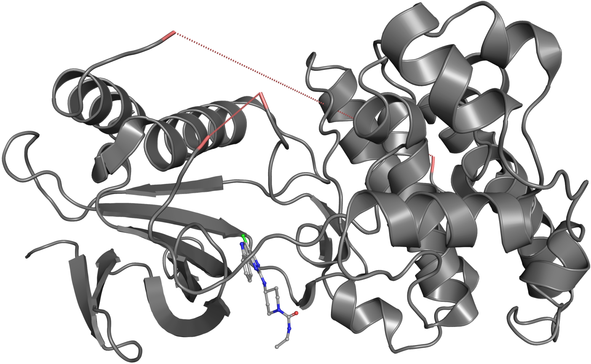

   Visualisation of disordered regions in PDB entry 2P33. The chain breaks caused by
   missing residues are connected with a dashed red line to indicate the missing
   sequence.

Entities in CREDO
=================

An entity in |CREDO| is at least one residue that forms a :doc:`biological molecule </objects/biomolecule>`,
for example a polypeptide chain or a syntethic ligand. Entities are classified further
based on their `mmCIF entity_poly type <http://www.ebi.ac.uk/pdbe/docs/exchange/mmcif_pdbx.dic/Items/_entity_poly.type.html>`_.
In |CREDO|, an entity is simply a chain or a set of residues with additional annotation.
The entities used in CREDO are described in this section.

Polypeptides
------------

:doc:`Polypeptides </objects/polypeptide>` in |CREDO| are chains having the mmCIF
entity type ``polypeptide(L)`` or in very rare cases ``polypeptide(D)``.

Oligonucleotides
----------------

:doc:`Oligonucleotides </objects/oligonucleotide>` are chains of mmCIF entity type
``polyribonucleotide`` (RNA), ``polydeoxyribonucleotide`` (DNA) or rarely 
``polydeoxyribonucleotide/polyribonucleotide hybrid``.

Polysaccharides
---------------

Chains having the mmCIF entity type ``polysaccharide(D)`` are classified as
:doc:`polysaccharides <objects/polysaccharide>` in |CREDO|.

Ligands
-------

Any non-polymer or a polymer with less than 11 residues in case of a peptide ligand.
:doc:`Ligands <objects/ligand>` can also be covalently bound to another entity.

Components
^^^^^^^^^^

In case of peptide ligands, a *ligand component* is a residue that is part of the
peptide ligand chain.

Sequence-to-structure mapping
=============================

All :doc:`residues </objects/residue>` stored in CREDO are mapped to the corresponding
`UniProt <http://www.uniprot.org/>`_ counterpart in order to facilitate analysis,
particularly in the context of the effects of sequence variations on protein structure
and function. As a consequence, each :doc:`polypeptide </objects/polypeptide>`
PDB residue can be traced back to a protein sequence amino acid or even to a codon
in the coding sequence of the underlying gene if a UniProt identifier is available
for that particular structure. The mappings are obtained in XML format from the
*Structure integration with function, taxonomy and sequence* (`SIFTS <http://www.ebi.ac.uk/pdbe/docs/sifts/>`_)
initiative that aims to work towards the integration of various bioinformatics
resources (Velankar *et al*., 2005). 

Data validation
===============

Crystal structures of protein-ligand complexes are never perfectly accurate representations
of atomic coordinates for a number of reasons. The primary result of X-ray crystallography
is diffraction data leading to electron density. The actual atomic coordinates are
merely a model that fits the obtained electron density as well as possible.The
fitting process itself it not always straightforward depending on the quality of
the diffraction data and the experience of the crystallographer. Difficult to crystallise
targets for example might have a low resolution (quantity of the data collected) or
the crystallographer lacks the expertise when dealing with small molecules, leading
to a variety of inherent or avoidable problems (Hawkins *et al*., 2008). Consequently,
data validation methods have to be implemented to avoid the inclusion of uncertain or
erroneous data in a dataset to be used for analysis. The quality of an X-ray crystal
structure can be considered in terms of both the quality of the crystallographic data,
such as resolution and the completeness of the structure and whether the biochemical
insight provided is sound or not. The former aspect is usually straightforward to validate
using the structure factors that are deposited alongside the primary coordinates.
It has to be stressed, however, that not all entries in the PDB, older structures in
particular, have deposited structure factors.

Diffraction-component precision index
-------------------------------------

The quality of a protein crystal structure is commonly assessed by both nominal
resolution and :math:`R_{free}`. The resolution of a crystal structure is merely a
quantitative measure for the coallesced data, not an indicator of how well the fitted
model agrees with the experimental data. The :math:`R_{free}` value measures the
agreement between observed and calculated structure factor amplitudes for a test
set of reflections that is omitted during the refinement process (Brunger, 1992).
Hence, it is a good indicator of model quality by distinguishing between well fitted
and poorly fitted ones. A good indicator of structure quality that takes into account
:math:`R_{free}` and does not require an electron density map for calculation is
the *diffraction-component precision index* (DPI) that was introduced by Cruickshank (1999)
in order to estimate the uncertainty of atomic coordinates obtained by structural
refinement of protein diffraction data. The original equation was later simplified
using two approximations by Blow (2002) to make the DPI easier to calculate from
experimental data. The whole concept of using the DPI as a metric to assess structure
quality was introduced to the virtual screening community by Goto *et al*. (2008)
whose formula to calculate the DPI is shown below:

.. math::
   \sigma(r,B_{avg})=2.2N_{atoms}^{1/2}V_{a}^{1/2}N_{obs}^{-5/6}R_{free}

:math:`N_{atoms}` is the number of atoms in the unit cell, :math:`V_{a}` its volume and
:math:`N_{obs}` the number of unique crystallographic reflections. The equation given
by Goto *et al*. is slightly different from the version derived by Blow because the
latter is calculating coordinate error for a particular axis, while Goto *et al*.
are calculating the error in the distance. Blow also rearranged the formula to display
the relationship between nominal resolution and atom coordinate precision (with
Goto *et al*. coefficient):

.. math::
   \sigma(r,B_{avg})=0.22(1+s)^{1/2}V_{m}^{-1/2}C^{-5/6}R_{free}d_{min}^{5/2}

In this arrangement :math:`s` is the percent solvent present in the crystal, :math:`V_{m}`
the asymmetric unit volume to molecular weight ratio, :math:`C` the completeness
of the data and :math:`d_{min}` the nominal resolution. With the help of this formula
it is possible to calculate a theoretical minimum DPI value, i.e. uncertainty of
the atomic coordinates for a given structure. For this purpose, the solvent content
:math:`s` was set to zero, the completeness of data :math:`C` to 1.0 (100%) and a
:math:`V_{m}` assumed of 2.4ų. The DPI metric, the average atom coordinate uncertainty
in a structure, is simple to understand and straightforward to compare between
structures. The drawback however is that the DPI only gives the *average precision of
atomic coordinates* in a structure.

Other methods used in CREDO
---------------------------

Besides the DPI a number of other validation methods are used. The chemical component
dictionary allows the comparison of experimental with ideal coordinates thereby
identifying *incomplete residues* and *missing ligand atoms*. As a general rule
of thumb, ligand atoms, which are not covalently bound to the protein according
to the information given in the PDB connection table, were labelled as *clashing*
if they were found to be within 1.2Å of a residue atom. Problems with the soundness
of the biochemical interpretation on the other hand are much harder to spot and
usually require expert knowledge. The fitting of small molecules into electron
density in particular illustrates this problem. In a considerable number of crystal
structures from the PDB, small molecules show a very high strain (10 kcal/mol or
greater above the global minimum) although the structure factors indicate a valid
structure (Perola and Charifson, 2004).

Known interactions in molecular recognition
===========================================

Aromatic ring interactions
--------------------------

Aromaticity is a very common property in biomolecules as well as synthetic compounds
and has a pivotal role in many signalling events. The aromatase enzyme for example is
responsible for aromatising the A ring of androgens, producing estrogens. Aromaticity
occurs in conjugated, cyclic systems where the :math:`pi`-electron clouds become
delocalised, leading to a small negative charge on each side and a small positive
charge on the periphery. Thus, interactions between aromatic ring systems are potentially
energetically favourable. The analysis of high-resolution X-ray crystal structures
as well as ab initio calculations showed that aromatic side chains of amino acids
preferentially align in an off-centered (*of* in figure **b** below) parallel orientation
(McGaughey *et al*., 1998) followed by a t-shaped like arrangement (*ef*) (Chakrabarti and Bhattacharyya, 2007).
The geometry of ring interactions can be divided into nine subtypes using the dihedral
angle between the planes :math:`P` and the angle :math:`j` between the centroid of
one ring and the normal vector of the other ((Chakrabarti and Bhattacharyya, 2007), figure **b** below).

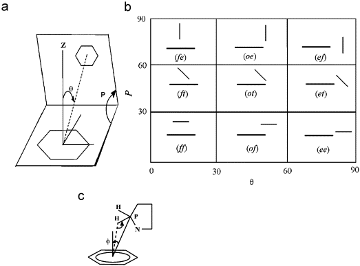
   
   Geometry of aromatic ring interactions. **a** Definition of the angles :math:`P`,
   the dihedral angle between the planes and :math:`j`, the angle between the normal
   of one plane and the vector between the two geometric ring centers. **b** Schematic
   representation and nomenclature definition for the orientations of the planes
   corresponding to different combinations of both angles. Reprinted fom Chakrabarti
   and Bhattacharyya (2007).

It has to be emphasised that the space that can be occupied by the rings is not symmetric,
i.e. the space that the other ring can occupy decreases if angle :math:`j` decreases.
Hence, one would expect the three geometries (*ef*, *et*, *ee*) to have an increased
probability of occurrence (Blundell *et al*., 1986).

Interaction definition
^^^^^^^^^^^^^^^^^^^^^^

Several parameters are stored for each aromatic ring interaction in |CREDO|: the
distance :math:`d` between the centroids, the dihedral angle :math:`P`, the angle
:math:`\theta` between the first ring's normal and the vector between the two ring
centroids, the angle :math:`\iota` between the second ring's normal and again the
vector between the two ring centroids and finally the distance between the two
closest atoms of the aromatic rings. All interactions are recorded where :math:`d`
is less than or equal to 6.0Å. The interactions can afterwards be filtered with
stricter parameters by the user, if desired. 

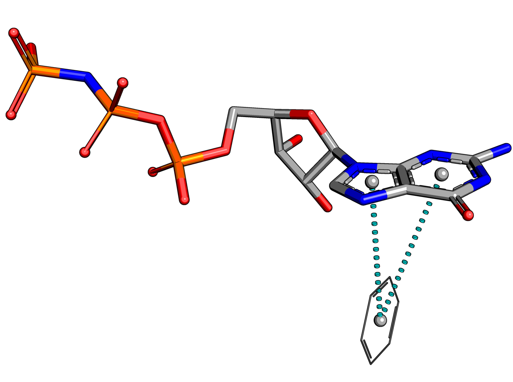

Atom-aromatic interactions
--------------------------

Interaction types
^^^^^^^^^^^^^^^^^

Interactions between atoms and aromatic ring systems are generally recorded if the
distance between the atom and the ring centroid is less than or equal to 4.5Å and
the angle between the vector (atom-centroid) and the ring normal is less than or
equal to 30.0°. Atom-aromatic ring interactions are then further classified as follows:

Interaction types
^^^^^^^^^^^^^^^^^

:math:`\pi`-carbon
''''''''''''''''''

Atom-aromatic ring interactions are labelled as :math:`\pi`-carbon if the atom is
a weak hydrogen bond donor.

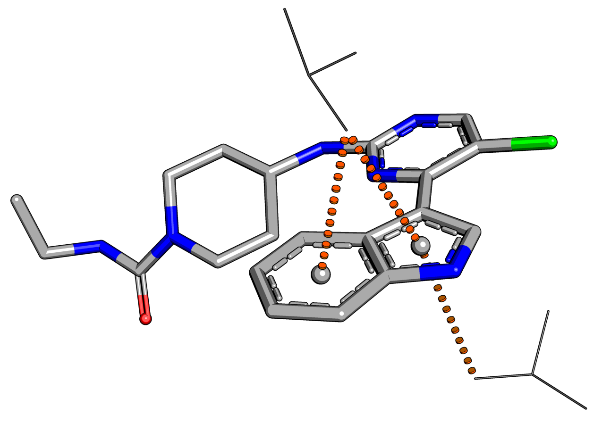

:math:`\pi`-cation
''''''''''''''''''

The delocalised :math:`\pi`-electron cloud of aromatic ring systems creates a negative
charge on both faces of the planar ring which in turn can potentially interact with
positively charged groups. Recent analysis of X-ray crystal structures and *ab initio*
quantum mechanics calculations showed that these interactions are favourable indeed
and occur in protein-ligand interactions (Crowley and Golovin, 2005; Biot *et al*., 2003;
Ma and Dougherty, 1997). Atom-aromatic ring interactions are labelled as :math:`\pi`-cation
if the atom is positively ionisable.

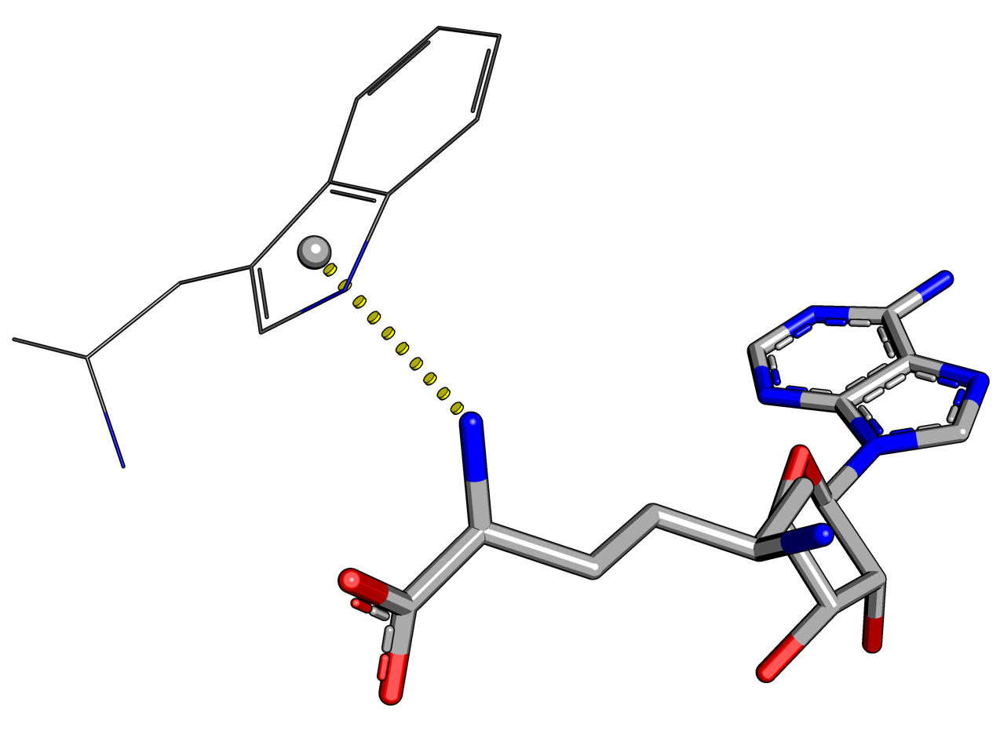
   
:math:`\pi`-donor
'''''''''''''''''

Atom-aromatic ring interactions are labelled as :math:`\pi`-donor if the atom is
a hydrogen bond donor.

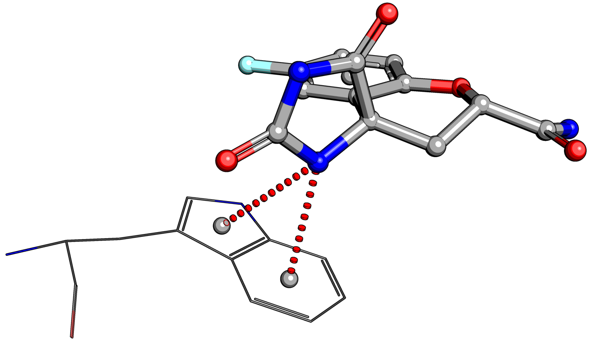

:math:`\pi`-halogen
'''''''''''''''''''

Atom-aromatic ring interactions are labelled as :math:`\pi`-halogen if the atom is
a halogen bond donor.

Interatomic contacts
--------------------

Structural Interaction Fingerprints (SIFTs)
^^^^^^^^^^^^^^^^^^^^^^^^^^^^^^^^^^^^^^^^^^^

Deng *et al*. introduced the concept of *Structural Interaction Fingerprints* (SIFts)
with the aim to translate three-dimensional interaction data into a one-dimensional
vector. In the original implementation, a SIFt was simply defined as a 7-bit binary
string for each residue where each position indicates the presence or absence of an
interaction feature. In |CREDO|, SIFTs are assigned to interatomic contacts but can
easily be generated for binding site residues if necessary.

Contact definition
^^^^^^^^^^^^^^^^^^

Interatomic interactions are recorded between all residues in a structure using
a radial cut-off of 5Å. Hence, intramolecular contacts are stored as well as long
as they occur between residues. Moreover, only interactions between atoms that are
at least *partially exposed to the surface* are considered. 

Secondary contacts
^^^^^^^^^^^^^^^^^^

The radial cut-off method has the disadvantage that the interaction between two
atoms might in fact be disrupted by a third atom that is actually closer to the
first than the second. The PyMOL screenshot below shows an example where the contact
with the main-chain carbon (red dashed line) would normally not be considered as
an interatomic interaction. In |CREDO|, secondary contacts are identified by measuring
the height of the triangle formed by an interatomic contact and all possible third
contacts are closer to the first than the second.

.. image:: static/images/2p33-secondary-contact.png
   :width: 1635 px
   :height: 991 px
   :scale: 50 %
   :alt: Secondary contact
   :align: center

Structural interaction type
^^^^^^^^^^^^^^^^^^^^^^^^^^^

The integer-based ``structural_interaction_type`` flag of a :doc:`contact <objects/contact>`
is simply the sum of the ``entity_type_bm`` bit mask of the parent :doc:`residue <objects/residue>`.
Two interacting atoms of poplypeptide residues would have a ``structural_interaction_type``
of 64 (32+32). This field can be used to quickly filter certain interaction types from a query, e.g.
only protein-protein contacts and no solvent interactions.

Intramolecular contacts
^^^^^^^^^^^^^^^^^^^^^^^

All *interresidue* contacts are recorded as well with the same criteria as intermolecular
interactions.

Atom types
^^^^^^^^^^

Atom types are identified with the help of SMARTS patterns. These pattern searches
are performed on the whole asymmetric unit of a PDB entry and the determined atom
types assigned to each atom. This approach is not only helpful in identifying atom
types for unknown small molecules, it also has the advantage that it includes
non-standard amino acids and that it can distinguish between different amino acid
linkage types. As a result, non-standard amino acids such as Phosphotyrosine are
not ignored but treated like any other residue.

Contact types
^^^^^^^^^^^^^

A contact type consists of up to four parameters that have to be satisfied: the
atom types of the interacting atoms *i* and *j*, distance and angle criteria. Atoms
types *i* and *j* are exchangeable in all cases although some atom types are very
likely to occur only in ligands such as halogen bond donor or metal. Contact types
are not mutually exclusive, but at least one type must be set.

+---------------+-----------------+-----------------+----------------------------------------------------------------------+---------------------------------------------------+
| contact type  | atom type *i*   | atom type *j*   | distance                                                             | angle                                             |
+===============+=================+=================+======================================================================+===================================================+
| covalent      | any             | any             | .. math::                                                            |                                                   |
|               |                 |                 |    \left\Vert a_{i}-a_{j}\right\Vert \leq cov(a_{i})+cov(a_{j})      |                                                   |
+---------------+-----------------+-----------------+----------------------------------------------------------------------+---------------------------------------------------+
| van der Waals | any             | any             | .. math::                                                            |                                                   |
| clash         |                 |                 |    \left\Vert a_{i}-a_{j}\right\Vert \leq vdw(a_{i})+vdw(a_{j})      |                                                   |
+---------------+-----------------+-----------------+----------------------------------------------------------------------+---------------------------------------------------+
| van der Waals | any             | any             | .. math::                                                            |                                                   |
|               |                 |                 |    \left\Vert a_{i}-a_{j}\right\Vert \leq vdw(a_{i})+vdw(a_{j})+0.1Å |                                                   |
+---------------+-----------------+-----------------+----------------------------------------------------------------------+---------------------------------------------------+
| proximal      | any             | any             | .. math::                                                            |                                                   |
|               |                 |                 |    \left\Vert a_{i}-a_{j}\right\Vert \leq5.0Å                        |                                                   |
+---------------+-----------------+-----------------+----------------------------------------------------------------------+---------------------------------------------------+
| hydrogen bond | hydrogen bond   | hydrogen bond   | .. math::                                                            | .. math::                                         |
|               | acceptor        | donor           |    \left\Vert a_{i}-a_{j}\right\Vert \leq vdw(a_{j})+vdw(H)+0.1Å     |    \angle(a_{i},a_{i}H,a_{j})\geq90\text{°}       |
+---------------+-----------------+-----------------+----------------------------------------------------------------------+---------------------------------------------------+
| weak hydrogen | weak hydrogen   | hydrogen bond   | .. math::                                                            | .. math::                                         |
| bond          | bond donor      | acceptor        |    \left\Vert a_{i}-a_{j}\right\Vert \leq vdw(a_{j})+vdw(H)+0.1Å     |    \angle(a_{i},a_{i}H,a_{j})\geq130\text{°}      |
+---------------+-----------------+-----------------+----------------------------------------------------------------------+---------------------------------------------------+
| halogen bond  | halogen bond    | halogen bond    | .. math::                                                            | .. math::                                         |
|               | donor           | acceptor        |    \left\Vert a_{i}-a_{j}\right\Vert \leq vdw(a_{i})+vdw(a_{j})+0.1Å |    \Theta_{1}\geq120\text{°}                      |
+---------------+-----------------+-----------------+----------------------------------------------------------------------+---------------------------------------------------+
| ionic         | positively      | negatively      | .. math::                                                            |                                                   |
|               | ionisable       | ionisable       |    \left\Vert a_{i}-a_{j}\right\Vert \leq4.0Å                        |                                                   |
+---------------+-----------------+-----------------+----------------------------------------------------------------------+---------------------------------------------------+
| metal complex | metal           | hydrogen bond   | .. math::                                                            |                                                   |
|               |                 | acceptor        |    \left\Vert a_{i}-a_{j}\right\Vert \leq2.8Å                        |                                                   |
+---------------+-----------------+-----------------+----------------------------------------------------------------------+---------------------------------------------------+
| aromatic      | aromatic        | aromatic        | .. math::                                                            |                                                   |
|               |                 |                 |    \left\Vert a_{i}-a_{j}\right\Vert \leq4.0Å                        |                                                   |
+---------------+-----------------+-----------------+----------------------------------------------------------------------+---------------------------------------------------+
| hydrophobic   | hydrophobe      | hydrophobe      | .. math::                                                            |                                                   |
|               |                 |                 |    \left\Vert a_{i}-a_{j}\right\Vert \leq4.5Å                        |                                                   |
+---------------+-----------------+-----------------+----------------------------------------------------------------------+---------------------------------------------------+
| carbonyl      | carbonyl carbon | carbonyl oxygen | .. math::                                                            |                                                   |
|               |                 |                 |    \left\Vert a_{i}-a_{j}\right\Vert \leq3.6Å                        |                                                   |
+---------------+-----------------+-----------------+----------------------------------------------------------------------+---------------------------------------------------+

Covalent
''''''''

Covalent bonding of ligands to proteins such as enzymes is often irreversible and
the binding mode of inhibitors such as certain drugs and toxic compounds. Although
the identification of covalently bonded ligands presents a computational challenge, it
is nevertheless important to be able to distinguish them from non-covalently bound
ligands. A covalent bond can be described in a simple model as the sharing of electrons
between atoms, ranging from one electron pair to up to four in extreme cases and can
vary in strength depending on the geometry of the molecular orbitals. Covalent bonds
are the strongest intermolecular interactions and responsible for the stability of a
molecule itself.

Van der Waals & van der Waals clash
'''''''''''''''''''''''''''''''''''

Van der Waals forces is the term used to describe the relatively weak non-covalent
interactions between uncharged atoms or molecules and differ from covalent or ionic
bonding. The electron clouds of two atoms in close proximity will influence each
other: random fluctuations in polarisation of one atom may create a transient electric
dipole, which induces a transient, opposite electric dipole in the other nearby atom.
Coupling of dipoles will lower mutual energy (Parsegian, 2006). The electron clouds
of close atoms will start to repel each other and the distance at which the attractive
interaction of the dipoles balance the repulsive effects is said to be in van der Waals
contact. The Lennard-Jones potential is a mathematically simple model that combines
the repulsive component and the attractive forces into one approximation:

.. math::
   V_{\left(r\right)}=4\varepsilon\left[\left(\frac{\sigma}{r}\right)^{12}-\left(\frac{\sigma}{r}\right)^{6}\right]

Where in the case of two atoms :math:`r` is the interatomic distance, :math:`\varepsilon`
is the depth of the potential well and :math:`\sigma` the distance at which the potential
between the atoms is zero. The first term in this equation describes the repulsion
component whereas the latter describes long-range attraction through dispersion
forces. The range of this potential depends on the atoms properties’ and is usually
approximated through a hard sphere representation, the so-called van der Waals
radius of an element. Although weak in nature, the abundance of these interactions
makes them significant for molecular recognition processes.

Proximal
''''''''

Interactions, where the interatomic distance is larger than the van der Waals
distance but smaller than the distance cut-off (5Å) are called proximal in CREDO.

Hydrogen bonds
''''''''''''''

A hydrogen bond is the attractive interaction between a hydrogen atom covalently
bound to an electronegative atom (hydrogen bond donor) and another highly electronegative
atom that has at least one non-bonding orbital pointing at the hydrogen (acceptor).
The strength of this interaction highly depends on the electronegativity of the
involved atoms and their respective geometries. In terms of geometry, hydrogen bonds
are strongest in a orientation where the electrostatic interactions are strongest,
usually a straight line. In biological systems, the strength typically ranges from 5
to 29 kJ/mol (O-H•••N). Importantly, at room temperature the thermal energy of
an aqueous solution is close to the energy required to break hydrogen bonds. Water
molecules have the ability to form four hydrogen bonds at the same time thereby
creating so-called bridged hydrogen bonds between two molecules. The ability to
identify or engineer these water-mediated hydrogen bonds in protein-binding sites
can be exploited in drug design (Ladbury, 1996).

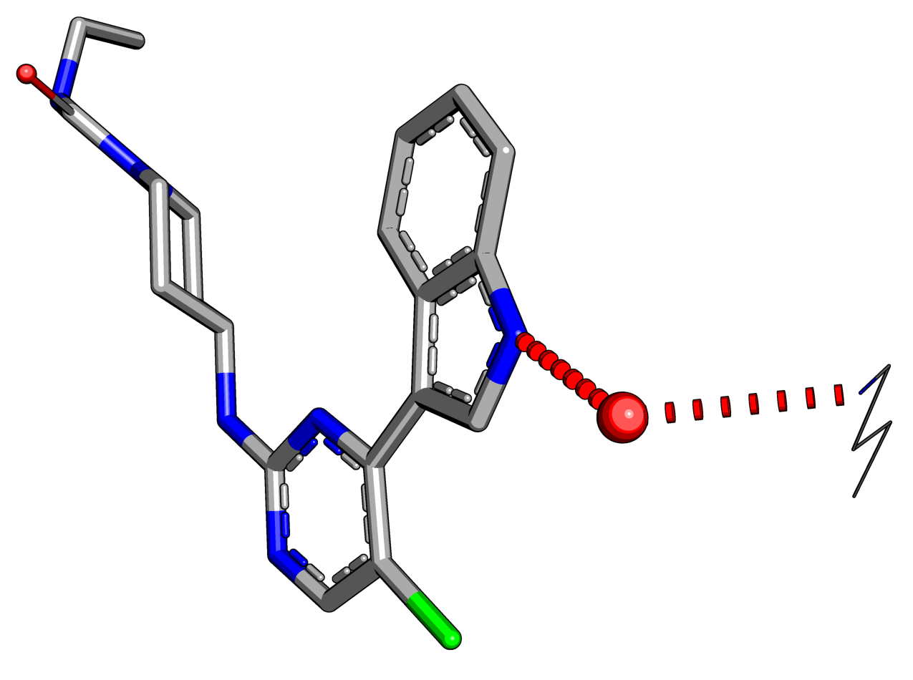
   
Weak Hydrogen bonds
'''''''''''''''''''

The conventional definition of hydrogen bonds has been expanded in recent years
to include weaker donors such as C-H groups and acceptors like the :math:`\pi`-electron
clouds of aromatic rings (Desiraju and Steiner, 2001; Chakrabarti and Bhattacharyya,
2007). The importance of weak hydrogen bonds in protein-ligand interactions has
been elucidated as well (Pierce *et al*., 2002). X-H•••pi weak hydrogen bonds are not
strongly directional due to the delocalised :math:`\pi`-electrons and their energy
range is between 8-16 kJ/mol, making them weaker than traditional hydrogen bonds
but stronger than C-H•••O bonds (Desiraju and Steiner, 2001). Interestingly, weak
hydrogen bonds in the form C-H•••pi have been identified to occur ubiquitously in
almost all proteins as well and cannot be classified as hydrophobic interactions
(Chakrabarti and Bhattacharyya, 2007; Brandl *et al*., 2001). Hence, they are likely to
be involved in protein-ligand interactions as well.

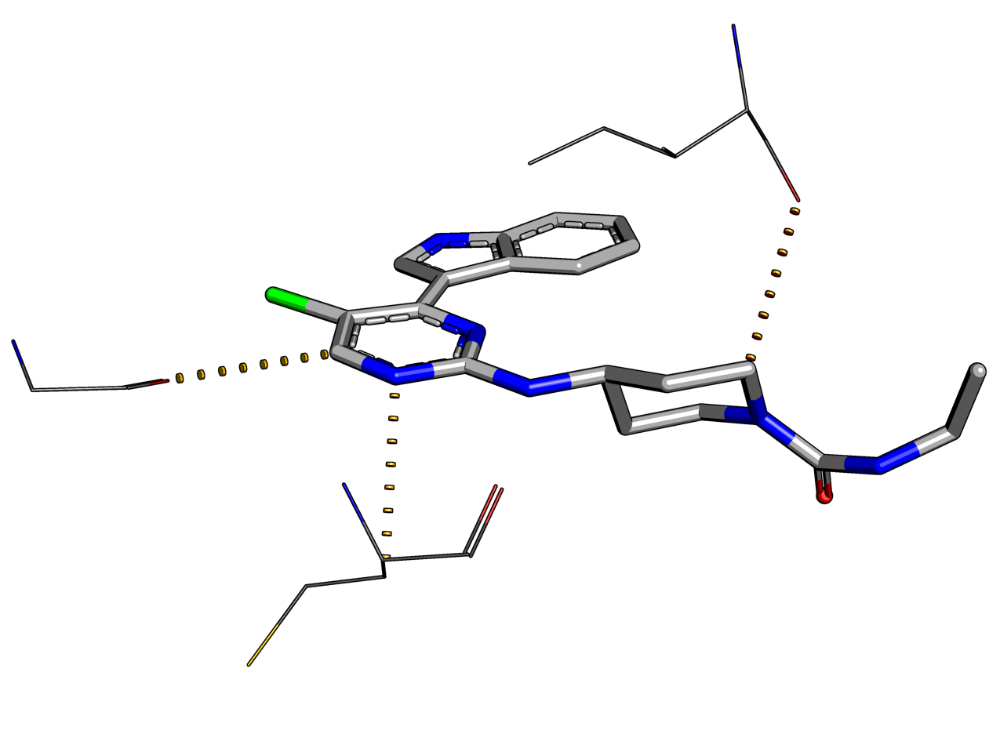
   
Halogen bonds
'''''''''''''

Short range interactions between oxygen and halogens have been known in organic
chemistry since the 1950’s and recently have been utilised in the design of supramolecular
assemblies (Auffinger *et al*., 2004; Voth *et al*., 2007) as well as in drug design
(Lu *et al*., 2009). However, functional groups containing halogens are often incorporated
into leads to increase lipophilicity thus improving lipid membrane penetration.
Halogens are also known to increase affinity by imposing conformational restrictions
on molecular structure, particularly ring systems. The ability of halogens to form
strong electrostatic interactions that can compete with hydrogen bonds has only been
coming to light fairly recently. Recent quantum mechanics calculations have shown
that these interactions are comparable in strength to classical hydrogen bonding.
Furthermore, the strength of the interaction depends on the specific halogen element
and increases with its atomic mass (Cl < Br < I) (Lu *et al*., 2009).

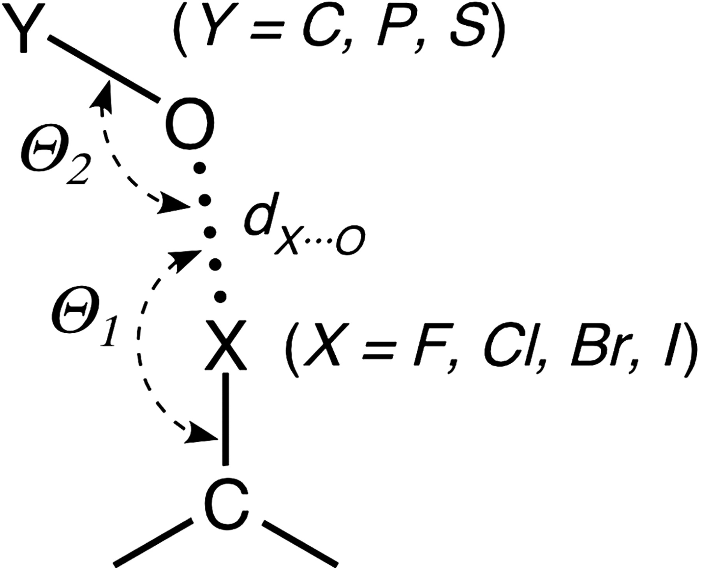

   Geometry of halogen bonds. The distance between the oxygen and the halogen atom
   has to be between the sum of the covalent and the van der Waals radii. :math:`\Theta_{1}`
   is the angle of the C-X bond relative to the oxygen acceptor and :math:`\Theta_{2}`
   the angle of the halogen relative to the O-Y bond. Reprinted from Auffinger *et al*. (2004).

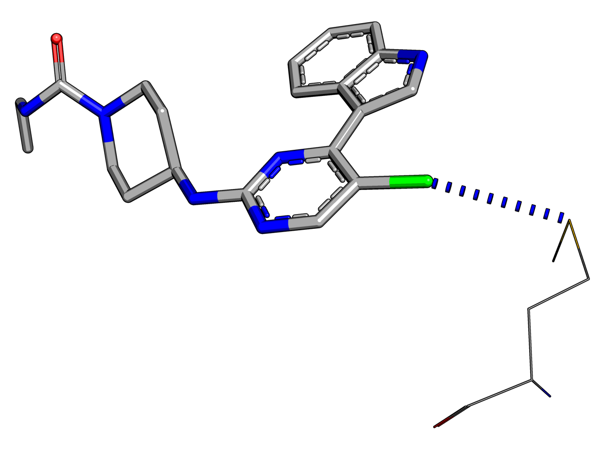

Ionic bonds
'''''''''''

Oppositely charged ions attract each other electrostatically and form ionic bonds.
Ions are created if one atom donates an electron to another, thereby forming a
positively charged cation and a negatively charged anion, both having a stable
electron configuration as a result. The attraction between the opposing charges
causes the ions to come together and form a bond. The strength of ionic interactions
can be described using Coulomb’s law:

.. math::
   F=\frac{Q_{1}Q_{2}}{\varepsilon r^{2}}

The force :math:`F` of ionic interactions in solution depends on the magnitude of
the charges :math:`Q`, the distance between the ions :math:`r` and the distance-dependent
dielectric constant of the solvent :math:`\varepsilon`. In water, which has a high
dielectric constant, the strength will be much less compared to non-polar solvents.
In addition, the force is distance-dependent and ionic interactions therefore will
only work on short-range in biological systems.

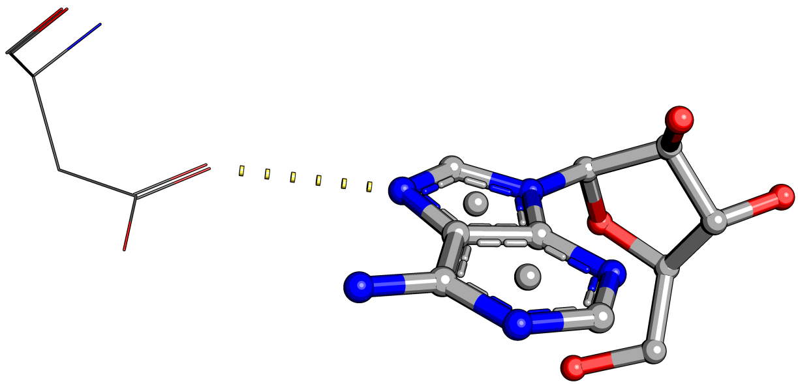
   
Metal complexes
'''''''''''''''

A metal or coordination complex is a structure consisting of a metal atom surrounded
by other electron-pair donating atoms. Metal complexes play important roles in
biochemistry, particularly in enzymes where one empty attachment site of the complex
is used either to bind or to convert the substrate. In addition, metal complexes can
be of structural importance as well, in zinc fingers for example where the ribbon-like
polypeptide chain is stabilised by a zinc coordination complex.

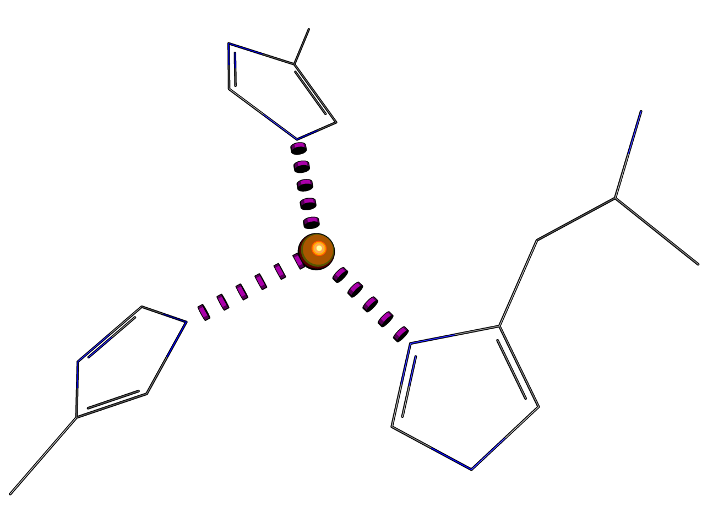
   
Aromatic
''''''''

Hydrophobic
'''''''''''

The strength of hydrophobic interactions is not the result of any intrinsic attractions
between atoms. Hydrophobic interactions are the consequence of a system’s desire
(here a molecule) to achieve thermodynamic stability by minimising the number of
ordered water molecules around hydrophobic areas. Ordered water is created because
hydrophobic areas of a molecule are not able to form any attractive interactions with
polar groups such as water thereby causing a loss of entropy. As a consequence, a
system will minimise the number of ordered water molecules on its surface by reducing
its solvent exposed hydrophobic area either by adopting a more packed conformation
or by interacting with other apolar surfaces. The process of desolvation is energetically
favourable in this case and often occurs in enzyme-substrate complexes. In drug
design, hydrophobicity is often exploited to gain affinity against a particular
target (Waring, 2010; Ladbury *et al*., 2009) although this often comes at the price
of larger molecular size and loss of specificity. In CREDO, the definition from
PATTY (Bush and Sheridan,1993), RDKit (http://www.rdkit.org) and MOE (http://www.chemcomp.com)
is used, defining hydrophobes as *nonpolar atoms in a nonpolar bonded environment*
(Bush and Sheridan, 1993).

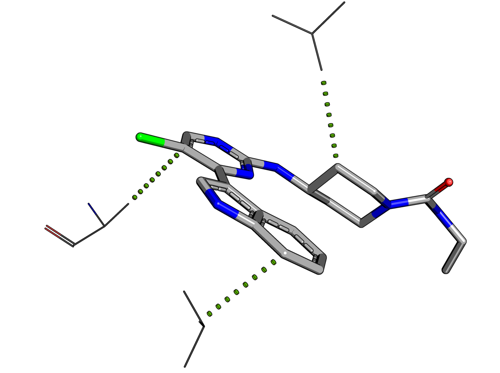
   
Carbonyl
''''''''

Carbonyl groups can be frequently found in both proteins and organic small molecules.
It has been shown (Allen *et al*., 1998) by investigation of crystallographic data
and *ab initio* molecular-orbital calculations that carbonyl-carbonyl interactions
can compete with hydrogen bonds. The attractive energies are the result of non-covalent
dipolar interactions of the >C(d+)•••O(d-) dipole that are not mediated through
hydrogen bonding. The authors determined a maximum cut-off distance value for this
interaction of 3.62 Å during their ab initio calculations.

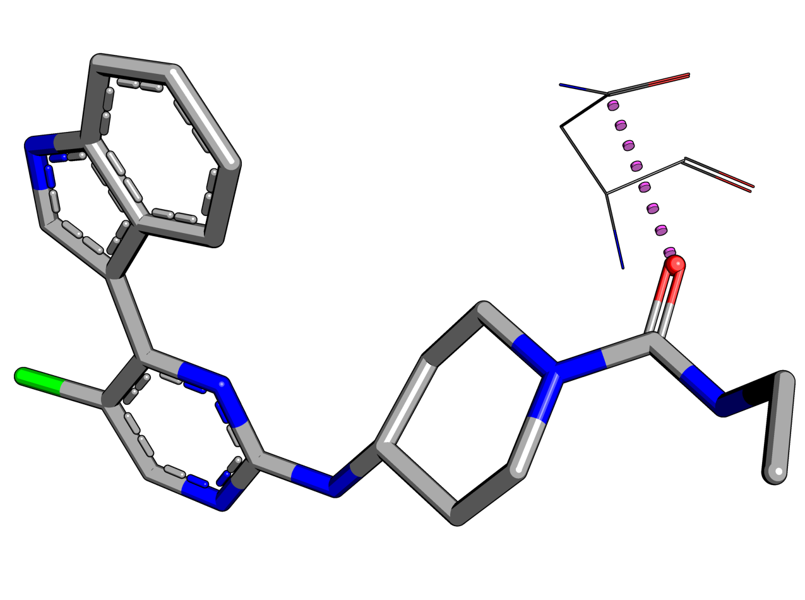

Cross references to other databases
===================================

An important task in data warehousing, particularly in the case of small molecules, is
to find equal objects across different databases. Usually every object in a database
is assigned an internal identifier that acts as a primary key. Sometimes another
immutable identifier is added to represent the object to the *outside world* and to
allow stable mappings. Hence, the same object such as a small molecule is generally
registered with different identifiers in database systems. A chemistry-centric
registration is not trivial since the same molecule can exist in various forms due to
different tautomerisation and/or protonation states. In |CREDO|, identical compounds
are identified by string comparison of their isomeric SMILES strings. This solution
was chosen as it is extremely fast due to indexes that can created for strings (high
cardinality) and because it works natively in the RDBMS. This solution however,
required that all SMILES strings were generated with the same software using the
same parameters. The OEChem toolkit is used to create canonical isomeric SMILES
strings using the same parameters for aromaticity and a neutral pH model to ensure
that carboxylic acids for example are always converted to the same form. :doc:`Cross
references </objects/xref>` are not exclusive to chemical components but assigned
to a few objects in |CREDO| including :doc:`structures </objects/structure>`, :doc:`chains </objects/chain>`
and :doc:`residues </objects/residue>` from sources such as UniProt or ChEMBL.

Cheminformatics routines on the server
======================================

Retrieving, modifying and converting chemical information is an essential task in
cheminformatics. Thus, it is desirable to have this functionality available where the
chemical information, e.g. a compound library, is actually stored, which is usually in
a relational database. Relational database management systems do not include any
routines for this purpose but they are available as extensions (so-called cartridges)
from either commercial vendors or open source projects. The RDKit database cartridge
is installed on the CREDO server to provide the all-important pattern matching,
substructure searching and fingeprint similarity routines.The cartridge functions
are available either directly through SQL or conveniently wrapped as part of the
|credoscript| API.

Database schema
===============

