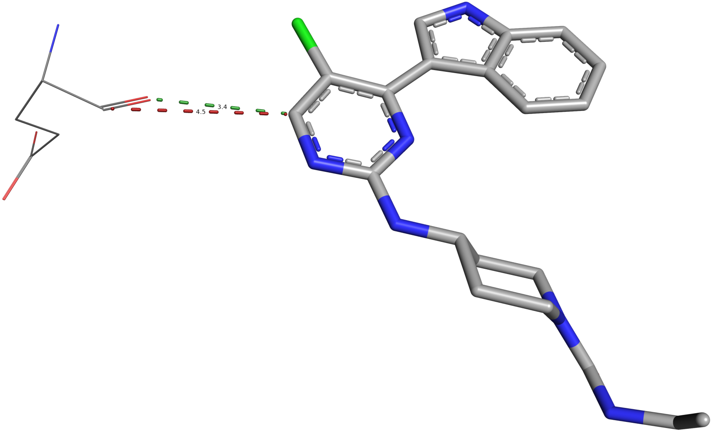

******************
The CREDO Database
******************

Introduction
============

The |CREDO| database was developed to facilitate the analysis of the structural
interactome, i.e. structurally characterised interactions between biological molecules
provided by X-ray crystallography, NMR and other biophysical approaches. 

Biological assemblies
=====================

The top-ranking *stable* prediction from PDBe PISA is used to generate the relevant
biological assembly. The asymmetric unit (ASU) is only used if a stable prediction
cannot be found or a prediction does simply not exist.

Generation of quaternary structures
-----------------------------------

Biological assemblies are generated by applying rotations ans translations to chains
of the asymmetric unit. A new PDB chain identifier is assigned to each newly transformed
chain. Clashing solvent atoms are removed and ligands are treated specially by either
removing the completely superimposed duplicate or by creating a new alternate location
group based on an RMSD cut-off. Atom serial are afterwards reassigned to the whole
biological assembly.

.. NOTE::
    The PDB identifiers (atom serial, residue number, PDB chain identifier) of atoms 
    in biological assemblies might be different from those found in the ASU provided
    by the PDB mirrors. These identifiers are only changed in newly generated chains,
    existing ones are left unchanged - except for atom serials, which are reassigned
    to the full biological assembly.

Entities in CREDO
=================

An entity in |CREDO| is at least one residue that forms a :doc:`biological molecule </objects/biomolecule>`,
for example a polypeptide chain or a syntethic ligand. Entities are classified further
based on their `mmCIF entity_poly type <http://www.ebi.ac.uk/pdbe/docs/exchange/mmcif_pdbx.dic/Items/_entity_poly.type.html>`_.
In |CREDO|, an entity is simply a chain or a set of residues with additional annotation.
The entities used in CREDO are described in this section.

Polypeptides
------------

:doc:`Polypeptides </objects/polypeptide>` in |CREDO| are residues that are part of an entity of mmCIF type
``polypeptide(L)`` or in very rare cases ``polypeptide(D)``.

Oligonucleotides
----------------

DNA, RNA or hybrid.

Polysaccharides
---------------

Ligands
-------

Any non-polymer or a polymer with less than 11 residues in case of a peptide ligand.
Ligands can also be covalently bounded to another entity.

Components
^^^^^^^^^^

In case of peptide ligands, a *ligand component* is a residue that is part of the
peptide ligand chain.

Sequence-to-structure mapping
=============================

Interactions
============

Aromatic ring interactions
--------------------------

Interaction definition
^^^^^^^^^^^^^^^^^^^^^^

Atom-aromatic interactions
--------------------------

Interaction definition
^^^^^^^^^^^^^^^^^^^^^^

Interaction types
^^^^^^^^^^^^^^^^^

Interatomic contacts
--------------------

Structural Interaction Fingerprints (SIFTs)
^^^^^^^^^^^^^^^^^^^^^^^^^^^^^^^^^^^^^^^^^^^

Deng et al. introduced the concept of *Structural Interaction Fingerprints* (SIFts)
with the aim to translate three-dimensional interaction data into a one-dimensional
vector. In the original implementation, a SIFt was simply defined as a 7-bit binary
string for each residue where each position indicates the presence or absence of an
interaction feature. In |CREDO|, SIFTs are assigned to interatomic contacts but can
easily be generated for binding site residues if necessary.

Contact definition
^^^^^^^^^^^^^^^^^^

Interatomic interactions are recorded between all residues in a structure using
a radial cut-off of 5Å. Hence, intramolecular contacts are stored as well as long
as they occur between residues. Moreover, only interactions between atoms that are
at least *partially exposed to the surface* are considered. 

Secondary contacts
^^^^^^^^^^^^^^^^^^

The radial cut-off method has the disadvantage that the interaction between two
atoms might in fact be disrupted by a third atom that is actually closer to the
first than the second. The PyMOL screenshot below shows an example where the contact
with the main-chain carbon (red dashed line) would normally not be considered as
an interatomic interaction. In |CREDO|, secondary contacts are identified by measuring
the height of the triangle formed by an interatomic contact and all possible third
contacts are closer to the first than the second.

Structural interaction type
^^^^^^^^^^^^^^^^^^^^^^^^^^^

The integer-based ``structural_interaction_type`` flag of a contact is simply the
sum of the ``entity_type_bm`` bit mask of the parent residue. Two interacting atoms
of poplypeptide residues would have a ``structural_interaction_type`` of 64 (32+32).
This field can be used to quickly filter certain interaction types from a query, e.g.
only protein-protein contacts and no solvent interactions.

Intramolecular contacts
^^^^^^^^^^^^^^^^^^^^^^^

All *interresidue* contacts are recorded as well with the same criteria as intermolecular
interactions.

Contact types
^^^^^^^^^^^^^

Interatomic contacts are classified based on their atom types and geometrical restraints
that have to be fulfilled. Contact types are not mutually exclusive, but at least
one type must be set.

+------------------------+---------------------------------------------------+----------+-------------+------------------------------------------------------------------+
| Contact type           | Description                                       | Distance | Geometric   | Example                                                          |
|                        |                                                   | cut-off  | constraints |                                                                  |
+========================+===================================================+==========+=============+==================================================================+
| *Covalent*             | foo                                               | eq       |    None     |                                                                  |
+------------------------+---------------------------------------------------+----------+-------------+------------------------------------------------------------------+
| *Van der Waals clash*  | foo                                               | eq       |    None     |                                                                  |
+------------------------+---------------------------------------------------+----------+-------------+------------------------------------------------------------------+
| *Van der Waals*        | foo                                               | eq       |    None     |                                                                  |
+------------------------+---------------------------------------------------+----------+-------------+------------------------------------------------------------------+
| *Proximal*             | foo                                               | eq       |    None     |                                                                  |
+------------------------+---------------------------------------------------+----------+-------------+------------------------------------------------------------------+
| *Hydrogen bonds*       | Description here                                  |          |             | .. image:: static/images/interaction_types/2P33-WATER-RAY.png    |
|                        |                                                   |          |             |    :scale: 25 %                                                  |
|                        |                                                   |          |             |    :alt: Mediated hydrogen bond in PDB Entry 2P33                |
|                        |                                                   |          |             |    :align: center                                                |
+------------------------+---------------------------------------------------+----------+-------------+------------------------------------------------------------------+
| *Weak Hydrogen bonds*  | Description here                                  |          |             | .. image:: static/images/interaction_types/2P33-WATER-RAY.png    |
|                        |                                                   |          |             |    :scale: 25 %                                                  |
|                        |                                                   |          |             |    :alt: Mediated hydrogen bond in PDB Entry 2P33                |
|                        |                                                   |          |             |    :align: center                                                |
+------------------------+---------------------------------------------------+----------+-------------+------------------------------------------------------------------+
| *Halogen bonds*        | Description here                                  |          |             | .. image:: static/images/interaction_types/2P33-XBOND-RAY.png    |
|                        |                                                   |          |             |    :scale: 25 %                                                  |
|                        |                                                   |          |             |    :alt: Mediated hydrogen bond in PDB Entry 2P33                |
|                        |                                                   |          |             |    :align: center                                                |
+------------------------+---------------------------------------------------+----------+-------------+------------------------------------------------------------------+
| *Ionic bonds*          | Description here                                  |          |             | .. image:: static/images/interaction_types/1PW7-IONIC-RAY.png    |
|                        |                                                   |          |             |    :scale: 25 %                                                  |
|                        |                                                   |          |             |    :alt: Mediated hydrogen bond in PDB Entry 2P33                |
|                        |                                                   |          |             |    :align: center                                                |
+------------------------+---------------------------------------------------+----------+-------------+------------------------------------------------------------------+
| *Metal complexes*      | Description here                                  |          |             | .. image:: static/images/interaction_types/1A65-MCOMPLEX-RAY.png |
|                        |                                                   |          |             |    :scale: 25 %                                                  |
|                        |                                                   |          |             |    :alt: Mediated hydrogen bond in PDB Entry 2P33                |
|                        |                                                   |          |             |    :align: center                                                |
+------------------------+---------------------------------------------------+----------+-------------+------------------------------------------------------------------+
| *Aromatic*             | Description here                                  |          |             |                                                                  |
|                        |                                                   |          |             |                                                                  |
|                        |                                                   |          |             |                                                                  |
|                        |                                                   |          |             |                                                                  |
+------------------------+---------------------------------------------------+----------+-------------+------------------------------------------------------------------+
| *Hydrophobic*          | Description here                                  |          |             | .. image:: static/images/interaction_types/2P33-HYPHOB-RAY.png   |
|                        |                                                   |          |             |    :scale: 25 %                                                  |
|                        |                                                   |          |             |    :alt: Mediated hydrogen bond in PDB Entry 2P33                |
|                        |                                                   |          |             |    :align: center                                                |
+------------------------+---------------------------------------------------+----------+-------------+------------------------------------------------------------------+
| *Carbonyl*             | Description here                                  |          |             | .. image:: static/images/interaction_types/2P33-CNYL-RAY.png     |
|                        |                                                   |          |             |    :scale: 25 %                                                  |
|                        |                                                   |          |             |    :alt: Mediated hydrogen bond in PDB Entry 2P33                |
|                        |                                                   |          |             |    :align: center                                                |
+------------------------+---------------------------------------------------+----------+-------------+------------------------------------------------------------------+

Cross references to other databases
===================================

Database schema
===============

