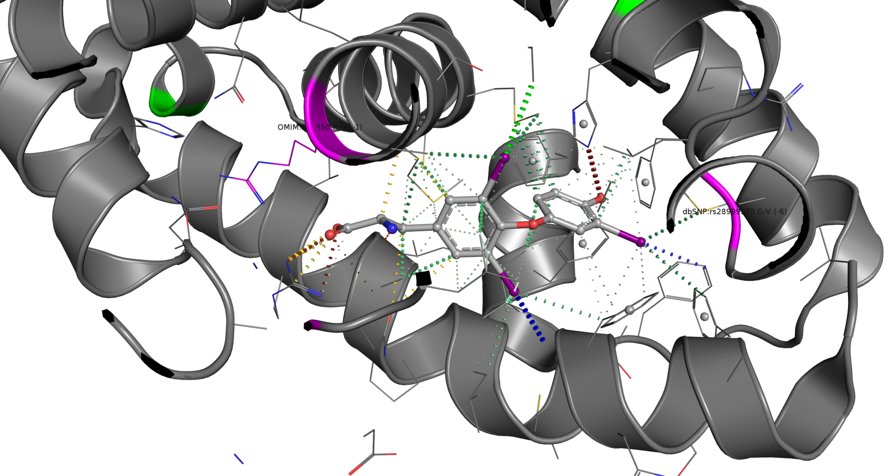
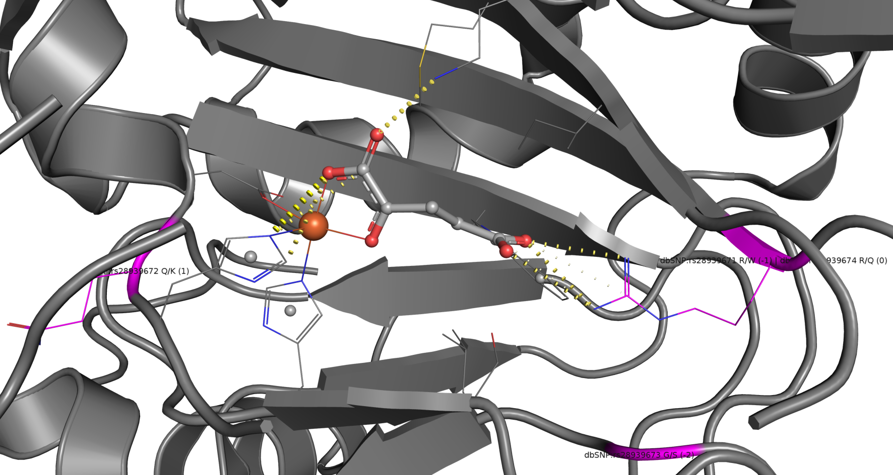
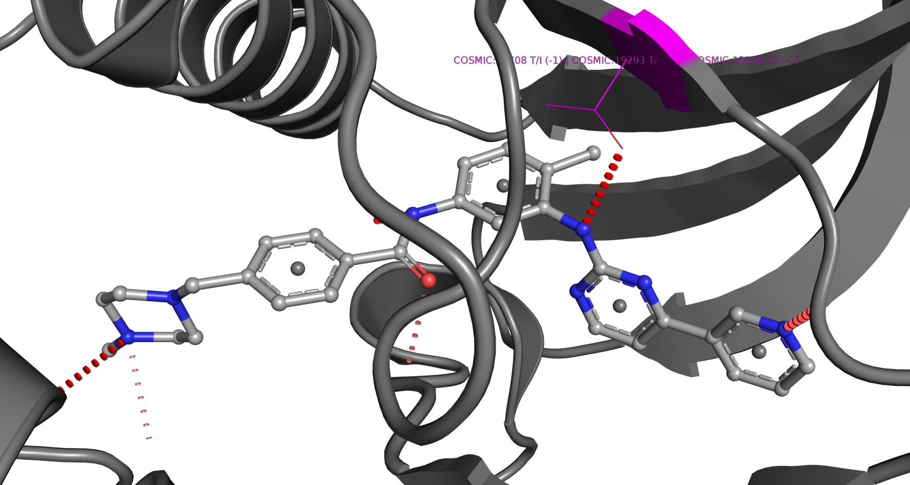

*********************
Structural variations
*********************

Variation databases
===================

Information about mutations and polymorphisms in the human genome has been
obtained from three databases. Sequence variations were obtained from the *Single
Nucleotide Polymorphism Database* (`dbSNP <http://www.ncbi.nlm.nih.gov/projects/SNP/>`_)
(Sherry et al., 2001) that is included in the `EnsEMBL <http://www.ensembl.org/index.html>`_
variation database (Hubbard et al., 2007), the *Online Mendelian Inheritance in Man*
(`OMIM <http://www.ncbi.nlm.nih.gov/omim>`_) database (McKusick, 1998) and the
*Catalogue of Somatic Mutations in Cancer* (`COSMIC <http://www.sanger.ac.uk/genetics/CGP/cosmic/>`_)
(Higgins et al., 2007). The dbSNP database is a public archive of genetic variation
within and across different species. Although the name says otherwise, this database
not only contains SNPs but also short deletion and insertion polymorphisms (indels),
microsatellite markers or short tandem repeats (STRs) and multinucleotide polymorphisms (MNPs).
Relevant for |CREDO| however are only the SNPs in protein coding regions of the genome.
A special case is `SNPedia <http://www.snpedia.com/index.php/SNPedia>`_, a wiki
that contains a small subset of polymorphisms from dbSNP where a phenotypic association
was described in peer-reviewed literature. SNPedia is included in |CREDO| for these
links to phenotypes and because it contains SNPs whose presence is tested for by
companies such as 23andMe, deCODEme, Navigenics and FamilyTreeDNA. The OMIM database
is very different and contains only mutations where there is some form of evidence
of phenotypic changes, usually pathological conditions such as genetic disorders.
All information about genetic mutations in OMIM is taken from the published literature.
COSMIC is a huge resource that contains vast amounts of data from tumour re-sequencing
studies, mostly based on a consensus of cancer genes (Futreal et al., 2004).

Identifying structural variations
=================================

The identification of variations in protein structures is a non-trivial task for
several reasons. The exact positions of variations in protein coding regions is
given only as a nucleotide number in the genetic sequence in mutation databases.
Fortunately, EnsEMBL already has mapped all variations in their variation database
onto the corresponding protein sequence. However, the amino acid position is given
only in the EnsEMBL sequence coordinate system and therefore has to be aligned with the
UniProt counterpart before it can be linked to :doc:`residues <objects/residue>` in
protein :doc:`structures <objects/structure>`. This was necessary because the
sequence-to-structure mapping provided by the EBI (Velankar et al., 2005) uses the
UniProt system for protein sequences.

Examples found in the PDB
=========================

   
   Crystal structure of T3-bound thyroid hormone receptor (PDB entry: `3GWS <http://www.pdb.org/pdb/explore/explore.do?structureId=3GWS>`_)
   with structural variations highlighted in magenta. The G345V polymorphism (dbSNP: rs28999970)
   causes inappropriately elevated thyroid-stimulating hormone (TSH) levels, which
   ultimately leads to generalized thyroid hormone resistance (GTHR), as demonstrated
   in functional assays by Parrilla et al. (1991). Interestingly, this mutation
   is in the ligand binding site where the the main chain of the wild type glycine
   forms strong interactions with an iodine atom of T3. This polymorphism is also
   part of the SNPedia collection.

   
   Human phytanoyl-CoA dioxygenase in complex with iron and 2-oxoglutarate (PDB
   entry: `2A1X <http://www.pdb.org/pdb/explore/explore.do?structureId=2AIX>`_).
   This enzyme is required for alpha-oxidation of certain branched fatty acids in
   peroxisomes and its deficiency is the major cause of `Refsum's disease <http://en.wikipedia.org/wiki/Refsum_disease>`_
   that results in the malformation of myelin sheaths around nerve cells. Highlighted
   in magenta are the polymorphisms affecting binding site-lining residues, particularly
   R275W (rs28939671). Only ionic interactions are shown in this representation.
   The substitution is also defined in SNPedia as a cause of Refsum's disease.

   
   C-KIT tyrosine kinase in complex with Imatinib (PDB entry: `1T46 <http://www.pdb.org/pdb/explore/explore.do?structureId=1T46>`_)
   with the position of the T670I Imatinib-resistant mutation highlighted.